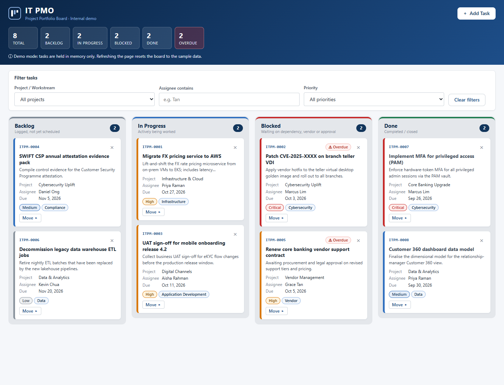

# kanban5 — IT PMO Kanban Board

A single-file Kanban board for tracking IT project tasks, built for a **fictitious** bank's internal demo and training use. It's vanilla HTML, CSS and JavaScript in one `index.html`, with no frameworks and no build step.

**Live demo:** https://alfredang.github.io/kanban5/



## Features

- Four columns: **Backlog, In Progress, Blocked, Done**. Move cards by drag-and-drop or with the keyboard-accessible **Move ▸** menu.
- Summary strip with counts for total, per-status and overdue tasks.
- Filters for project/workstream, assignee and priority. Column counts follow the filters, and the summary always counts every task.
- An **Add Task** modal with inline validation. New tasks get `ITPM-####` IDs.
- Deletion is confirmed inline on the card, with no browser dialogs.
- Overdue badges. Seed due dates are relative to today, so the overdue examples always show.
- Optional email notification for new tasks via [FormSubmit](https://formsubmit.co).

## Demo data and placeholders

- All tasks, people and projects are sample data. The bank is fictitious, and there are no real bank names or logos.
- **There's no persistence.** Tasks live in memory, so refreshing the page resets the board to the seed data. This is intentional.
- The notification endpoint is a placeholder: `YOUR_EMAIL@example.com`.

## Running locally

Double-click `index.html`, or:

```bash
start index.html          # Git Bash on Windows
open index.html           # macOS
```

It works straight from `file://`. You don't need a server.

## Configuration

Only one setting is configurable: the `FORMSUBMIT_ENDPOINT` constant at the top of the `<script>` block in `index.html`.

```js
const FORMSUBMIT_ENDPOINT = "https://formsubmit.co/ajax/YOUR_EMAIL@example.com";
```

To use it, replace the placeholder with a real address. FormSubmit emails that address once with an activation link. Until you activate it, submissions return `success: "false"`, and the app shows a warning toast. The card is still added either way, and email subjects are prefixed with `[IT PMO]`.

## Deployment

Every push to `main` deploys to GitHub Pages through [.github/workflows/pages.yml](.github/workflows/pages.yml). The workflow publishes the repo root as-is, because there's no build.

## Contributing conventions

The full list is in [CLAUDE.md](CLAUDE.md). The main rules:

- Vanilla only: no libraries, CDNs, web fonts or image files. Use inline SVG or Unicode for icons.
- Don't use `localStorage`, `sessionStorage`, IndexedDB or cookies.
- Don't use `alert()` or `confirm()`, and don't use `!important`. Colours and spacing come from CSS custom properties on `:root`.
- Pass every task field rendered into a card through `escapeHtml()`.
- Status keys (`backlog`, `inprogress`, `blocked`, `done`) are tied to element IDs (`list-<key>`, `count-<key>`, `sum-<key>`, `col-<key>-title`). If you change `STATUSES`, update the markup too.
- Keep branding neutral, and keep the `ITPM-####` ID format.

## Testing

There's no test suite. Check changes manually in a browser. To syntax-check the script block:

```bash
node -e "const h=require('fs').readFileSync('index.html','utf8');new Function(h.match(/<script>([\s\S]*?)<\/script>/)[1]);console.log('ok')"
```
